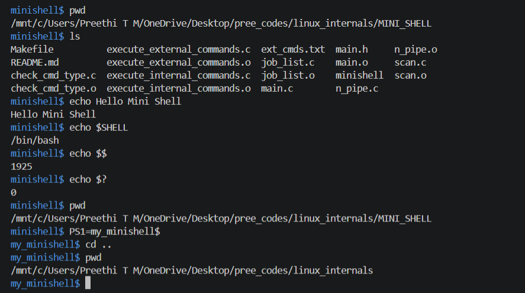
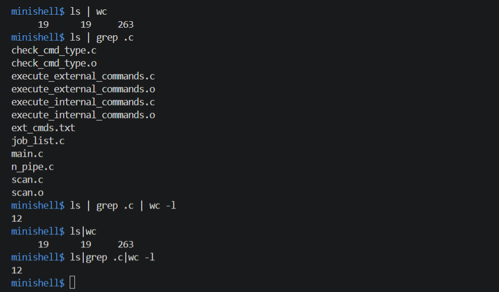
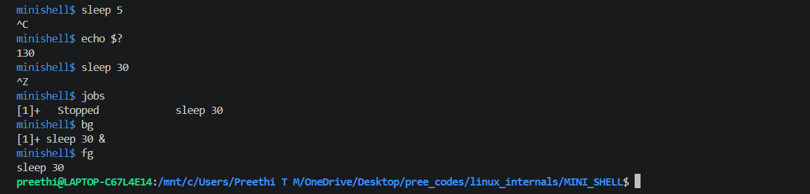

# Mini Shell in C

## 📌 Project Overview

This project implements a **Mini Shell** using the C programming language on Linux.

The shell provides a basic command-line interface for executing commands and demonstrates important **Linux Internals concepts** such as process creation, process execution, pipes, signal handling, and job control.

The project supports internal and external commands, single and multiple pipelines, foreground and background processes, signal handling, job management, and exit status handling.

---

## ✨ Features

* Execute few internal commands
* Execute few external commands
* Support single and multiple pipes
* Handle `SIGINT` (`Ctrl+C`)
* Handle `SIGTSTP` (`Ctrl+Z`)
* Support foreground and background processes
* Maintain and display background jobs
* Continue stopped jobs using `bg`
* Maintain command exit status using `$?`
* Process and job management

---

## 🔄 Shell Working

The Mini Shell follows the basic command execution flow:

```text
User Input
    ↓
Scan and Parse Command
    ↓
Identify Command Type
    ↓
Internal Command / External Command
    ↓
Create and Execute Process
    ↓
Handle Pipes / Signals / Jobs
    ↓
Display Shell Prompt
```

---

## 📂 Project Structure

```text
MINI_SHELL/
│
├── check_cmd_type.c
├── execute_external_commands.c
├── execute_internal_commands.c
├── ext_cmds.txt
├── job_list.c
├── main.c
├── main.h
├── n_pipe.c
├── scan.c
├── Makefile
└── README.md
```

---

## 📄 File Description

| File                          | Description                                                 |
| ----------------------------- | ----------------------------------------------------------- |
| `main.c`                      | Contains the main shell loop and controls program execution |
| `main.h`                      | Contains structures, macros, and function declarations      |
| `scan.c`                      | Handles command scanning and input processing               |
| `check_cmd_type.c`            | Identifies whether a command is internal or external        |
| `execute_external_commands.c` | Handles execution of external commands                      |
| `execute_internal_commands.c` | Handles execution of internal commands                      |
| `n_pipe.c`                    | Handles single and multiple pipe operations                 |
| `job_list.c`                  | Handles job list and background job management              |
| `ext_cmds.txt`                | Contains external command information                       |
| `Makefile`                    | Automates compilation and cleanup                           |

---

## 🛠️ Technologies Used

* **Programming Language:** C
* **Operating System:** Linux
* **Concepts:** Processes, Pipes, Signals, Job Control, IPC
* **System Calls:** `fork()`, `exec()`, `wait()`, `waitpid()`, `pipe()`
* **Signal Handling:** `SIGINT`, `SIGTSTP`
* **Compiler:** GCC
* **Build Tool:** GNU Make
* **Version Control:** Git and GitHub

---

## 🚀 Compilation and Execution

### Using Makefile

Compile the project:

```bash
make
```

Run the Mini Shell:

```bash
./minishell
```

Remove object files:

```bash
make clean
```

Remove object files and executable:

```bash
make fclean
```

Rebuild the project:

```bash
make re
```

---

## 🧪 Testing

The Mini Shell was tested with:

* Internal and external commands
* Single pipe
* Multiple pipes
* `Ctrl+C` signal handling
* `Ctrl+Z` signal handling
* Exit status using `$?`
* Stopped jobs using `jobs`
* Background execution using `bg`

---

## 📸 Sample Outputs

### 1. Basic Command Execution

Demonstrates external and built-in commands including `pwd`, `ls`, `echo`, `cd`, shell variables (`$SHELL`, `$$`, `$?`), and `PS1` prompt modification.



---

### 2. Pipes and Multiple Pipes

Demonstrates single pipe, multiple pipes, and pipe execution with and without spaces.



---

### 3. Signal Handling and Job Control

Demonstrates signal handling using `Ctrl+C` and `Ctrl+Z`, exit status, stopped and running jobs, `jobs`, `bg`, and `fg` operations.



---

## 🎯 Key Learning Outcomes

* Understanding Linux shell architecture
* Creating and managing processes
* Using `fork()` and `exec()` for process execution
* Implementing inter-process communication using pipes
* Handling terminal signals
* Understanding foreground and background processes
* Implementing basic job control
* Managing process exit status
* Using `wait()` and `waitpid()`
* Building a modular C project using multiple source files
* Using Makefile for automated compilation

---

## 🔮 Future Enhancements

* Add input and output redirection
* Add append redirection
* Add heredoc support
* Improve command parsing
* Add more shell built-in commands
* Improve job-control functionality

---

## 👩‍💻 Author

**Preethi T M**

Mini Shell developed as part of hands-on practice in **Linux Internals and Advanced C programming**.
