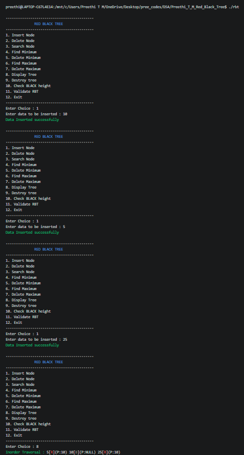
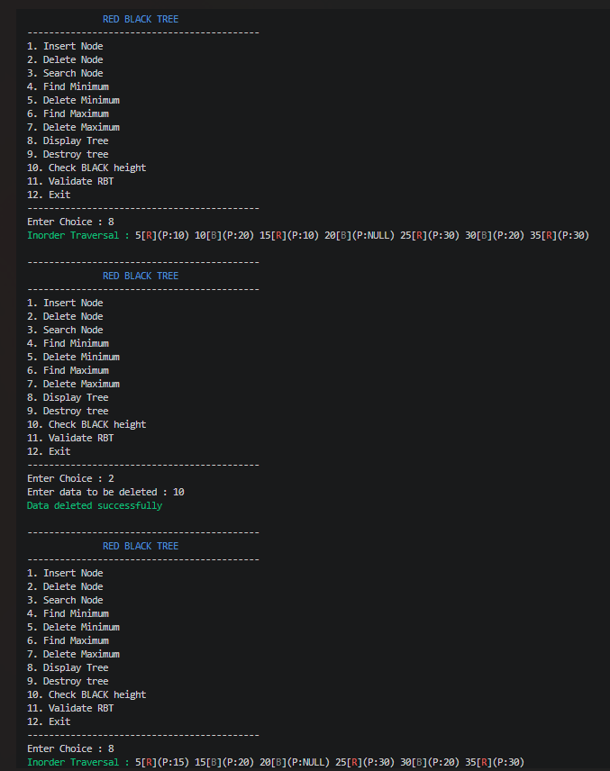
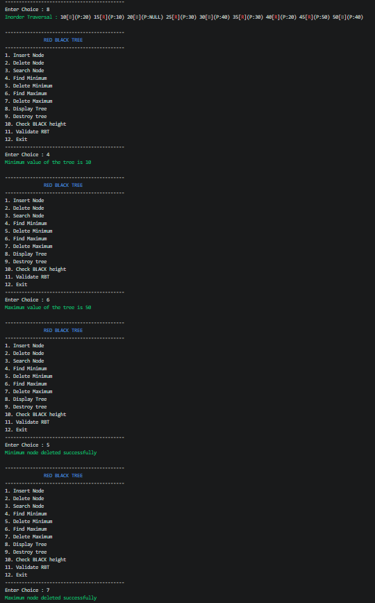

# Red-Black Tree in C

## 📌 Project Overview

This project implements a **Red-Black Tree** using the C programming language.

A Red-Black Tree is a self-balancing Binary Search Tree (BST) that maintains balance using **node colors (Red/Black)** and **tree rotations**.

The project supports insertion, deletion, searching, minimum/maximum operations, tree traversal, Black Height calculation, and validation of Red-Black Tree properties.

---

## ✨ Features

- Insert a node
- Delete a node
- Delete minimum node
- Delete maximum node
- Search for a node
- Find minimum and maximum values
- Inorder traversal
- Left rotation
- Right rotation
- Calculate Black Height
- Validate Red-Black Tree properties
- Display nodes with their colors
- Destroy/free the complete tree
- Handles Red-Black Tree insertion and deletion fix-up cases

---

## 🌳 Red-Black Tree Properties

The implementation maintains the following Red-Black Tree properties:

1. Every node is either **Red** or **Black**.
2. The root node is always **Black**.
3. Every `NULL` leaf is considered **Black**.
4. A Red node cannot have a Red child.
5. Every path from a node to its descendant `NULL` leaves contains the same number of Black nodes.

These properties ensure that the tree remains approximately balanced.

---

## ⏱️ Time Complexity

| Operation      | Time Complexity |
|----------- ----|-----------------|
| Search         | O(log n)        |
| Insert         | O(log n)        |
| Delete         | O(log n)        |
| Delete Minimum | O(log n)        |
| Delete Maximum | O(log n)        |
| Find Minimum   | O(log n)        |
| Find Maximum   | O(log n)        |
| Traversal      | O(n)            |
| Validation     | O(n)            |

---

## 📂 Project Structure

```text
Red-Black-Tree/
│
├── black_height.c
├── create_node.c
├── delete_fix.c
├── delete_max.c
├── delete_min.c
├── delete_node.c
├── destroy_tree.c
├── display.c
├── insert_fix.c
├── insert.c
├── left_rotate.c
├── main.c
├── min_max.c
├── rbt.h
├── right_rotate.c
├── search.c
├── transplant.c
├── validate_rbt.c
├── Makefile
└── README.md
```

---

## 📄 File Description

| File | Description |
|------|-------------|
| `main.c` | Contains the menu-driven interface and controls program execution |
| `rbt.h` | Contains structures, constants, and function declarations |
| `create_node.c` | Creates and initializes a new Red-Black Tree node |
| `insert.c` | Performs insertion of a new node |
| `insert_fix.c` | Restores Red-Black Tree properties after insertion |
| `delete_node.c` | Deletes a specified node from the tree |
| `delete_fix.c` | Restores Red-Black Tree properties after deletion |
| `delete_min.c` | Finds and deletes the minimum node |
| `delete_max.c` | Finds and deletes the maximum node |
| `search.c` | Searches for a value in the tree |
| `min_max.c` | Finds minimum and maximum values |
| `left_rotate.c` | Performs a left rotation |
| `right_rotate.c` | Performs a right rotation |
| `transplant.c` | Replaces one subtree with another during deletion |
| `black_height.c` | Calculates the Black Height of the tree |
| `validate_rbt.c` | Validates Red-Black Tree properties |
| `display.c` | Displays the tree using inorder traversal |
| `destroy_tree.c` | Frees all dynamically allocated nodes |
| `Makefile` | Automates compilation and cleanup |

---

## 🛠️ Technologies Used

- **Programming Language:** C
- **Data Structure:** Red-Black Tree
- **Concepts:** Binary Search Tree, Self-Balancing Trees, Recursion, Pointers
- **Memory Management:** Dynamic Memory Allocation
- **Compiler:** GCC
- **Build Tool:** GNU Make
- **Version Control:** Git and GitHub

---

## 🚀 Compilation and Execution

### Using Makefile

Compile the project:

```bash
make
```

Run the program:

```bash
./rbt
```

Clean generated object files and executable:

```bash
make clean
```

Rebuild the project from scratch:

```bash
make rebuild
```

---

## 🧪 Testing

The implementation can be tested using different operations such as:

- Sequential insertion
- Random insertion
- Searching existing values
- Searching non-existing values
- Deleting leaf nodes
- Deleting nodes with one child
- Deleting nodes with two children
- Deleting the root node
- Deleting minimum node
- Deleting maximum node
- Repeated insertion and deletion
- Validating the tree after modifications
- Checking Black Height

---
## 📸 Sample Outputs

### 1. Insertion and Tree Display

The following screenshot demonstrates insertion of nodes and inorder traversal with node colors and parent information.




### 2. Node Deletion

The following screenshot demonstrates deletion of a node followed by tree display and validation.




### 3. Red-Black Tree Validation and Black Height

The tree is validated after modifications and its Black Height is calculated.


### 4. Minimum and Maximum Operations

The following screenshot demonstrates finding and deleting minimum and maximum nodes.


---

## 🎯 Key Learning Outcomes

- Understanding the working of a **self-balancing Binary Search Tree**
- Implementing Red-Black Tree insertion
- Implementing Red-Black Tree deletion
- Understanding insertion and deletion fix-up cases
- Implementing left and right rotations
- Working with parent pointers
- Understanding subtree transplantation
- Calculating Black Height
- Validating Red-Black Tree properties
- Managing dynamically allocated memory
- Developing a modular C project using multiple source files
- Using Makefile for automated compilation

---

## 🔮 Future Enhancements

- Add automated test cases
- Improve tree visualization
- Add support for duplicate keys
- Improve input validation
- Add detailed operation logs
- Add graphical representation of the tree

---

## 👩‍💻 Author

**Preethi T M**

Red-Black Tree implementation developed as part of hands-on practice in **Data Structures and Advanced C programming**.